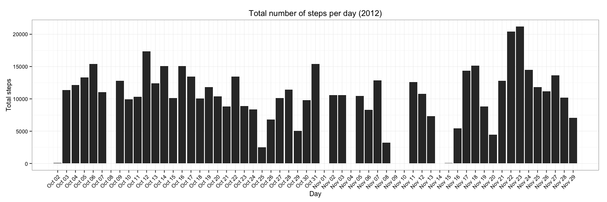
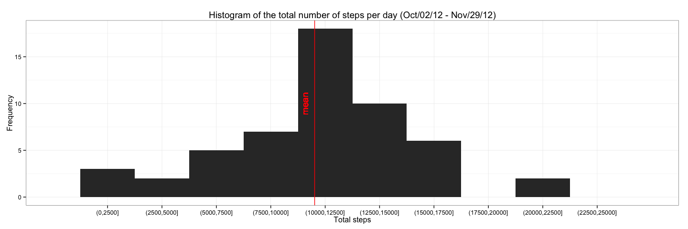
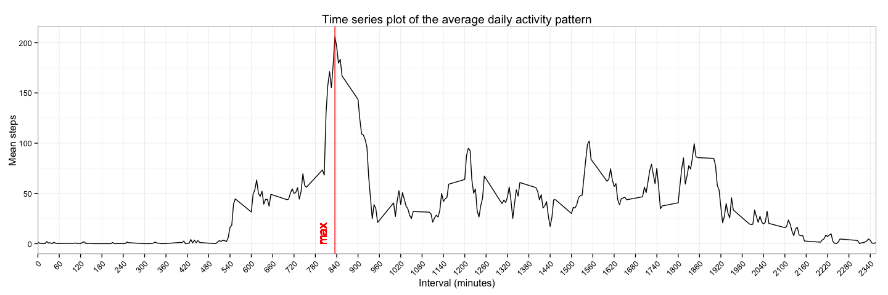
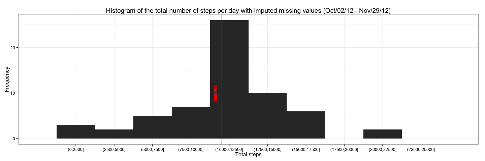
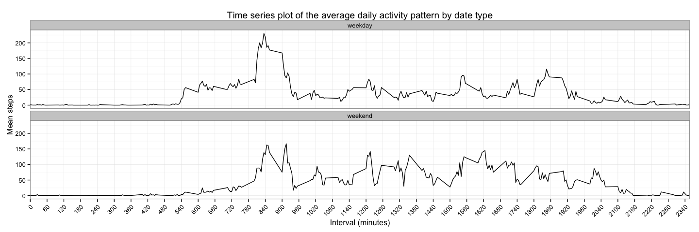

# Reproducible Research: Peer Assessment 1


## Loading and preprocessing the data

1. The data can be read with the defined classes

```r
data <- read.csv("./activity.csv", colClasses = c("numeric", "Date", "numeric"))
str(data)
```

```
## 'data.frame':	17568 obs. of  3 variables:
##  $ steps   : num  NA NA NA NA NA NA NA NA NA NA ...
##  $ date    : Date, format: "2012-10-01" "2012-10-01" ...
##  $ interval: num  0 5 10 15 20 25 30 35 40 45 ...
```

2. The data can be summarized as follows
<!-- html table generated in R 3.1.2 by xtable 1.7-4 package -->
<!-- Sun Mar  8 22:27:54 2015 -->
<table border=1>
<tr> <th>     steps </th> <th>      date </th> <th>    interval </th>  </tr>
  <tr> <td> Min.   :  0.00   </td> <td> Min.   :2012-10-01   </td> <td> Min.   :   0.0   </td> </tr>
  <tr> <td> 1st Qu.:  0.00   </td> <td> 1st Qu.:2012-10-16   </td> <td> 1st Qu.: 588.8   </td> </tr>
  <tr> <td> Median :  0.00   </td> <td> Median :2012-10-31   </td> <td> Median :1177.5   </td> </tr>
  <tr> <td> Mean   : 37.38   </td> <td> Mean   :2012-10-31   </td> <td> Mean   :1177.5   </td> </tr>
  <tr> <td> 3rd Qu.: 12.00   </td> <td> 3rd Qu.:2012-11-15   </td> <td> 3rd Qu.:1766.2   </td> </tr>
  <tr> <td> Max.   :806.00   </td> <td> Max.   :2012-11-30   </td> <td> Max.   :2355.0   </td> </tr>
  <tr> <td> NA's   :2304   </td> <td>  </td> <td>  </td> </tr>
   </table>

3. The data is cleaned as follows

```r
cleanData <- na.omit(data)
```

## What is the mean total number of steps taken per day?

1. The total number of steps per day can be calculated with

```r
totalStepsPerDay <- ddply(cleanData, .(date), summarize, totalSteps = sum(steps))
```

2. Bar plot of the total number of steps per day

```r
minDate <- min(totalStepsPerDay$date)
maxDate <- max(totalStepsPerDay$date)
g <- ggplot(totalStepsPerDay, aes(date, totalSteps))
g <- g + geom_bar(stat = "identity")
g <- g + scale_x_date(breaks = seq(minDate, maxDate, 1),
                      labels = date_format("%b %d"),
                      limits = c(minDate, maxDate))
g <- g + labs(x = "Day")
g <- g + labs(y = "Total steps")
g <- g + labs(title = expression("Total number of steps per day (2012)"))
g <- g + theme_bw()
g <- g + theme(axis.text.x = element_text(angle = 45, hjust = 1, vjust = 1))
g
```

 

3. Histogram of the total number of steps per day with mean

```r
labels <- levels(cut(totalStepsPerDay$totalSteps, seq(0, 25000, 2500), dig.lab = 5))
minDateChar <- format(minDate, format = "%b/%d/%y")
maxDateChar <- format(maxDate, format = "%b/%d/%y")
meanTotalSteps <- round(mean(totalStepsPerDay$totalSteps))
medianTotalSteps <- round(median(totalStepsPerDay$totalSteps))
g <- ggplot(totalStepsPerDay, aes(x = totalSteps))
g <- g + geom_histogram(bin = 2500)
g <- g + scale_x_discrete(labels = labels, breaks = seq(1250, 25000, 2500))
g <- g + geom_vline(aes(xintercept = meanTotalSteps), colour = "red")
g <- g + geom_text(aes(x = meanTotalSteps, label = "mean", y = 10),
                   colour = "red",
                   angle = 90,
                   vjust = -1.0,
                   text = element_text(size = 11))
g <- g + labs(x = "Total steps")
g <- g + labs(y = "Frequency")
g <- g + labs(title = paste0("Histogram of the total number of steps per day (", minDateChar, " - ", maxDateChar, ")"))
g <- g + theme_bw()
g
```

 

4. The mean and median of the total number of steps taken per day can be calculated as

```r
meanTotalSteps <- round(mean(totalStepsPerDay$totalSteps))
medianTotalSteps <- round(median(totalStepsPerDay$totalSteps))
```

**The mean is 10766 and the median is 10765.**

## What is the average daily activity pattern?

1. The average number of steps taken, averaged across all days (y-axis) per interval (x-axis) can be calculated as follows

```r
meanStepsPerInterval <- ddply(cleanData, .(interval), summarize, meanSteps = mean(steps))
```

2. Time series plot of the average daily activity pattern

```r
minInterval <- min(meanStepsPerInterval$interval)
maxInterval <- max(meanStepsPerInterval$interval)
maxTotalSteps <- meanStepsPerInterval$interval[which.max(meanStepsPerInterval$meanSteps)]
breaks <- seq(minInterval, maxInterval, 60)
labels <- as.character(breaks)
g <- ggplot(meanStepsPerInterval, aes(interval, meanSteps))
g <- g + geom_line()
g <- g + scale_x_discrete(labels = labels, breaks = breaks)
g <- g + geom_vline(aes(xintercept = maxTotalSteps), colour = "red")
g <- g + geom_text(aes(x = maxTotalSteps, label = "max", y = 10),
                   colour = "red",
                   angle = 90,
                   vjust = -1.0,
                   text = element_text(size = 11))
g <- g + labs(x = "Interval (minutes)")
g <- g + labs(y = "Mean steps")
g <- g + labs(title = "Time series plot of the average daily activity pattern")
g <- g + theme_bw()
g <- g + theme(axis.text.x = element_text(angle = 45, hjust = 1, vjust = 1))
g
```

 

3. The interval with the maximum average number of steps can be found through the following

```r
index <- which.max(meanStepsPerInterval$meanSteps)
intervalWithMaxMeanSteps <- meanStepsPerInterval$interval[index]
```

**The maximum average number of steps is 206 which corresponds to the interval of 835 minutes.**

## Imputing missing values

1. The total number of missing values in the dataset can be calculated as follows

```r
complete <- is.na(data)
numberOfMissingValues <- sum(complete)
```

**There are 2304 missing values in the data set.**

2. We use the average of the interval to fill in the missing values as the strategy for filling in all of the missing values in the dataset

```r
completedData <- data
completedData[complete, ]$steps <- vapply(completedData[complete, ]$interval,
                                          function (interval) {
                                              intervalIndex <- match(interval, meanStepsPerInterval$interval)
                                              steps <- meanStepsPerInterval$meanSteps[intervalIndex]
                                          },
                                          FUN.VALUE = numeric(1))
```

3. Histogram of the total number of steps per day with mean and imputed missing values

```r
completedTotalStepsPerDay <- ddply(completedData, .(date), summarize, totalSteps = sum(steps))
completedLabels <- levels(cut(completedTotalStepsPerDay$totalSteps, seq(0, 25000, 2500), dig.lab = 5))
completedMeanTotalSteps <- round(mean(completedTotalStepsPerDay$totalSteps))
completedMedianTotalSteps <- round(median(completedTotalStepsPerDay$totalSteps))
g <- ggplot(completedTotalStepsPerDay, aes(x = totalSteps))
g <- g + geom_histogram(bin = 2500)
g <- g + scale_x_discrete(labels = completedLabels, breaks = seq(1250, 25000, 2500))
g <- g + geom_vline(aes(xintercept = completedMeanTotalSteps), colour = "red")
g <- g + geom_text(aes(x = completedMeanTotalSteps, label = "mean", y = 10),
                   colour = "red",
                   angle = 90,
                   vjust = -1.0,
                   text = element_text(size = 11))
g <- g + labs(x = "Total steps")
g <- g + labs(y = "Frequency")
g <- g + labs(title = paste0("Histogram of the total number of steps per day with imputed missing values (", minDateChar, " - ", maxDateChar, ")"))
g <- g + theme_bw()
g
```

 

**After imputing the missing values the mean is 10766 and the median is 10766. While the mean remains the same (compared to the removed values), the median grows a step from 10765.**

**Taking a closer look at the previous histogram (where we removed the values), we can also notice that the total number of steps grew on some bins because we added more values. Hence the difference in the histogram is reflected by the fact that the frequencies grew.**

## Are there differences in activity patterns between weekdays and weekends?

1. We can determine whether a date is part of the weekday or weekend as follows

```r
completedData$dateType <- vapply(completedData$date,
                                 function (date) {
                                     dayOfWeek <- wday(date)
                                     type <- if (dayOfWeek == 1 || dayOfWeek == 7) "weekend" else "weekday"
                                     type
                                 },
                                 FUN.VALUE = character(1))
completedData$dateType <- factor(completedData$dateType)
```

2. Time series plot of the 5-minute interval (x-axis) and the average number of steps taken, averaged across all weekday days or weekend days (y-axis)

```r
completedMeanStepsPerInterval <- ddply(completedData, .(interval, dateType), summarize, meanSteps = mean(steps))
completedMinInterval <- min(completedMeanStepsPerInterval$interval)
completedMaxInterval <- max(completedMeanStepsPerInterval$interval)
completedMaxTotalSteps <- completedMeanStepsPerInterval$interval[which.max(completedMeanStepsPerInterval$meanSteps)]
completedBreaks <- seq(completedMinInterval, completedMaxInterval, 60)
completedLabels <- as.character(completedBreaks)
g <- ggplot(completedMeanStepsPerInterval, aes(interval, meanSteps, group = dateType))
g <- g + geom_line()
g <- g + facet_wrap(~ dateType, ncol = 1)
g <- g + scale_x_discrete(labels = completedLabels, breaks = completedBreaks)
g <- g + labs(x = "Interval (minutes)")
g <- g + labs(y = "Mean steps")
g <- g + labs(title = "Time series plot of the average daily activity pattern by date type")
g <- g + theme_bw()
g <- g + theme(axis.text.x = element_text(angle = 45, hjust = 1, vjust = 1))
g
```

 
